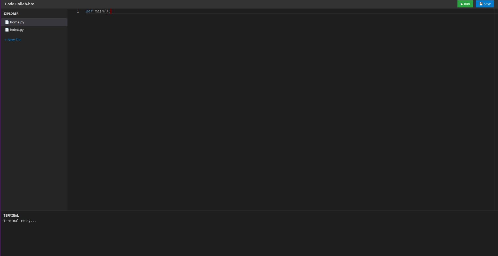
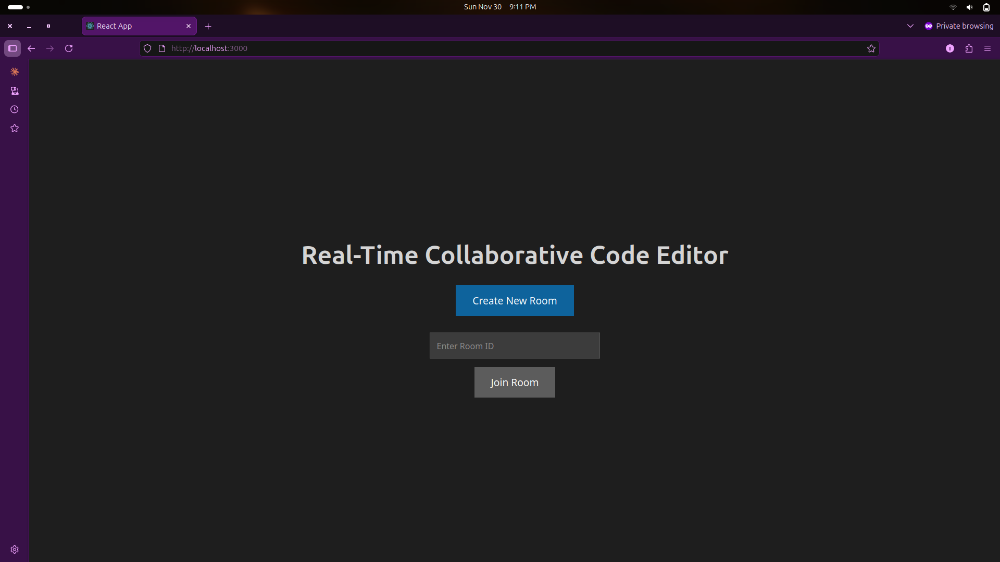
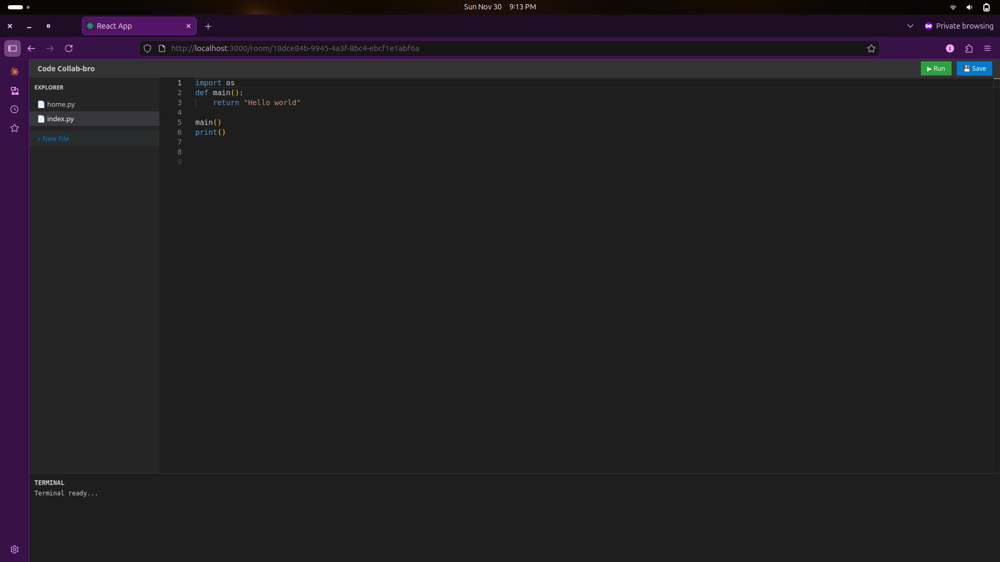
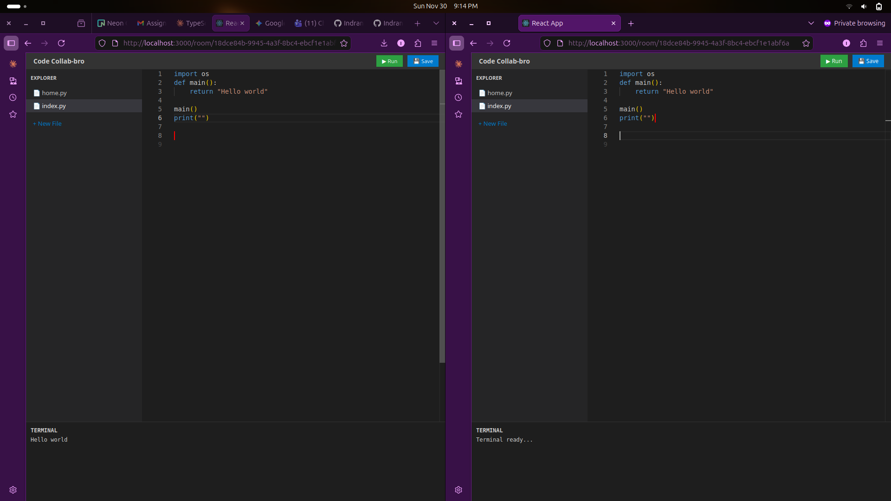
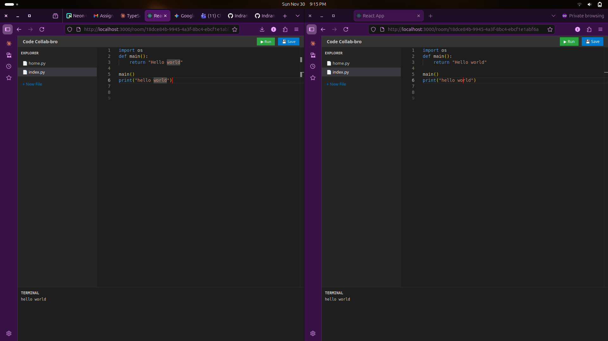
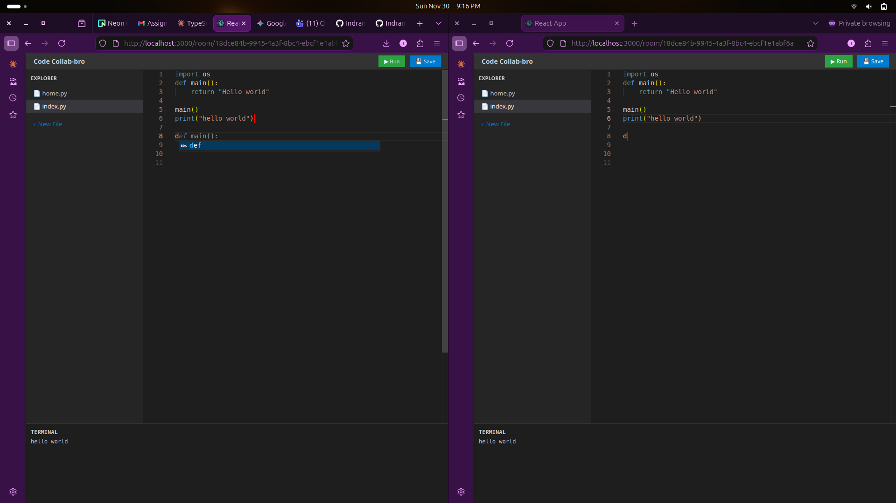

Real-Time Collaborative Code Editor

A lightweight, high-performance web application that allows developers to edit code together in real-time. Featuring file management, live cursor tracking, and an integrated code execution environment, this tool simplifies remote pair programming.

📸 Demo & Preview

See the application in action.

1. The Workspace
    
    A clean, dark-themed coding environment optimized for focus.

2. Real-Time Collaboration
    <video src="screenshot/colab-demo.webm" width="100%" autoplay loop muted></video>
    See other users' cursors and edits instantly as they type.

3. Code Execution & Terminal
    <video src="screenshot/code-execution-demo.webm" width="100%" autoplay loop muted></video>
    Execute Python code directly in the browser and see results immediately.

✨ Features

    Real-Time Collaboration: Powered by WebSockets, multiple users can edit the same file simultaneously with sub-second latency.

    Live Presence: See exactly where your teammates are working with color-coded remote cursors.

    File System Management: Create, switch between, and manage multiple files within a single room.

    Smart Autocomplete: Includes a mocked AI-style autocomplete that suggests code snippets (Ghost Text) as you type.

    Integrated Runner: Built-in Python execution engine to run your scripts and view output in an integrated terminal.

    Auto-Save: Changes are synced to the backend database to ensure work is never lost.

🚀 Installation & Setup

Prerequisites

    Node.js (v16 or higher)

    npm or yarn

    Python 3.9+ (For the backend)

1. Backend Setup

Important: The backend is hosted in a separate repository. You must set it up first for the application to work.

    Visit the backend repository: https://github.com/Indrane/prototype-backend

    Follow the instructions in that repository's README to:

        Clone the code.

        Install Python dependencies (fastapi, uvicorn, sqlalchemy, etc.).

        Start the server (usually running on port 8000).

2. Frontend Setup

Once your backend is running, follow these steps to set up the user interface:

    Clone this repository:
    Bash

git clone https://github.com/Indrane/frontend
cd frontend

Install dependencies:
Bash

npm install
# or
yarn install

Start the development server:
Bash

    npm start
    # or
    yarn start

    Open your browser and navigate to http://localhost:3000 (or the port shown in your terminal).

🧪 How to Test & Run the System

Follow these steps to verify that the collaboration and execution features are working correctly.

Step 1: Create a Room

When you first open the application, you may be redirected to a room or asked to create one (depending on current routing).

    

Step 2: Create a New File

    Look at the "EXPLORER" sidebar on the left.

    Click + New File.

    Enter a name (e.g., script.py).

    The new file will appear in the list and automatically open.

    

Step 3: Test Real-Time Sync

    Open the same URL (including the Room ID) in a second browser window or Incognito tab.

    Arrange the windows side-by-side.

    Type code in Window A.

    Verify: You should see the text appear in Window B instantly, along with a colored cursor showing the other user's position.

    

Step 4: Run Code

    Type a simple Python script, for example:
    Python

    print("Hello from the collaborative editor!")

    Click the ▶ Run button in the top right header.

    Verify: The "TERMINAL" panel at the bottom should display the output.

    

Step 5: Autocomplete

    Type a common keyword like def or import and wait a split second.

    Verify: A grey "ghost text" suggestion should appear. Press Tab to accept it.

    

🛠️ Technology Stack

    Frontend: React, TypeScript, Monaco Editor (VS Code core), Styled Components

    Backend: Python, FastAPI, WebSockets, SQLAlchemy

    Database: PostgreSQL (Compatible)